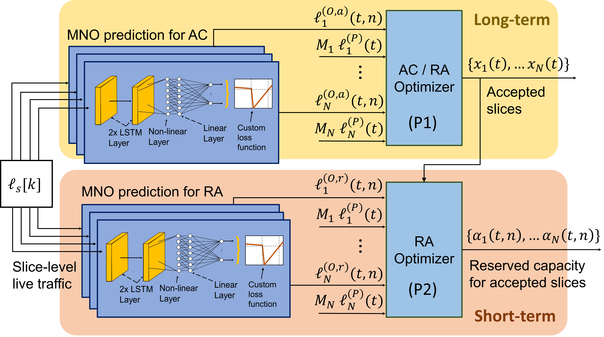

# kaNSaaS-Slicing

Code implemented in the paper:  "kaNSaaS: Combining Deep Learning and Optimization for Practical Overbooking of Network Slices", published in MobiHoc 2023, the 24th International Symposium on Theory, Algorithmic Foundations, and Protocol Design for Mobile Networks and Mobile Computing

To run the experiments: 

0. You can use the [Synthetic Dataset generator](kaNSaaS-Slicing/Generate_Synthetic_Dataset.ipynb) to generate your own synthetic data that emulates real-world network traffic (We obtain similar results in our experiments with synthetic and real-world datasets, please read the paper for more information)

1. Run the capacity Forecasting for the MNO  and Service Provider [MNO](/kaNSaaS-Slicing/Capacity_Forecasting/tesnnn_tmux_MNO_synthetic_pool_075.py) ,[SP](kaNSaaS-Slicing/Capacity_Forecasting/tesnnn_tmux_SP_synthetic_pool_15.py). The ones with hyperlink are the ones using multiprocessing, you can use the singular ones.

2. Following the predictions, you should [postprocess the predictions](kaNSaaS-Slicing/Postprocessing_Predictions.ipynb) to obtain the correct shape for the optimization problem. 

3. Then, you need to have a folder with the forecasting results of MNO,SP and Oracle to do the optimization problem, you can do it with [Create Forecasting Dataset](kaNSaaS-Slicing/Syn_Dataset/Create_Fcasting_Datasets.ipynb)

4. For a better performance of the optimizer, please [Normalize](kaNSaaS-Slicing/Syn_Dataset/Predictions_Normalizer.ipynb) the data

5. In [Optmizer](kaNSaaS-Slicing/Optimizer), you will find all the codes to run the optimization problem for the different scenarios, also with multiporcessing

6. Use [This notebook](kaNSaaS-Slicing/Exps_Plotter_analysis.ipynb) to observe the performance of the experiments and create a csv  and be able to compare with the benchmark in [Paper_plotter_fin](kaNSaaS-Slicing/Paper_plotter_fin.ipynb)

If you need help, do not hesitate to contact me at: sergi.alcala@imdea.org

If you use this work, please cite our work:

Sergi Alcalá-Marín, Antonio Bazco-Nogueras, Albert Banchs, Marco Fiore. 2023. kaNSaaS: Combining Deep Learning and Optimization for Practical Overbooking of Network Slices. In The Twenty-fourth International Symposium on Theory, Algorithmic Foundations, and Protocol Design for Mobile Networks and Mobile Computing (MobiHoc ’23), October 23–26, 2023,Washington, DC, USA. ACM, New York, NY, USA, 11 pages. https://doi.org/10.1145/3565287.3610265

